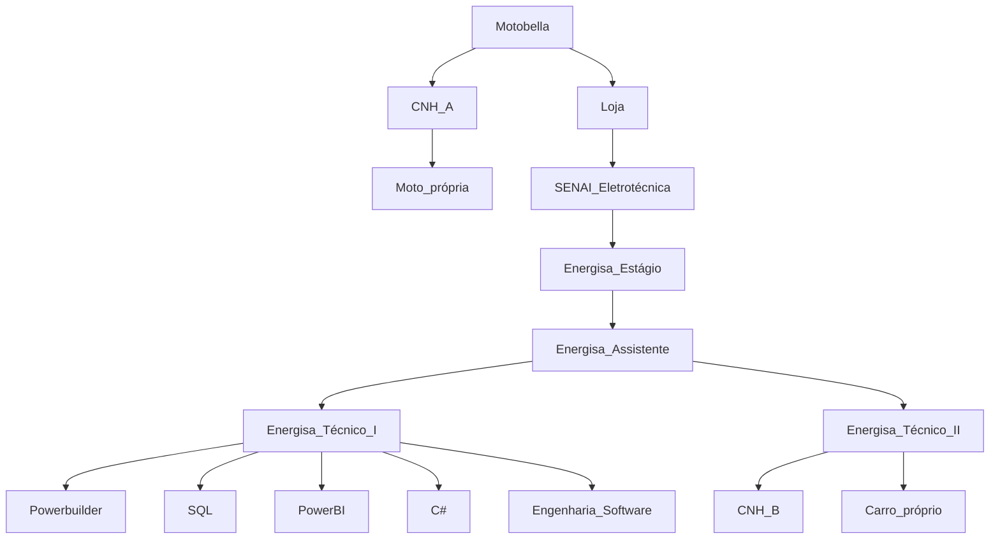

<!--Nome completo:-->
<h3 align="center">Edmar Chagas Pires</h3>
<h4 align="center"><a href="https://web.whatsapp.com/send/?phone=32988351572" rel="nofollow"><strong>(32) 9-8835 1572</strong></a></h4>

<!--Imagem decorativa:-->

<!--Biografia-->
<li>☄️ Eu sou um estudante de Engenharia de Software. 5° Período.</li>
<li>🌙 Procurando emprego. <strong>#OpenToWork.</strong></li>
<li>🌌 Nada é impossível para aquele que persiste. <em>Alexandre, o Grande 356 a.C</em></li>
<li>🪐 A excelência é um hábito.</li>
<li>🔭 No meu tempo livre tenho desenvolvido apps com carinho, confira meus projetos clicando <a href="https://github.com/edmarpires9?tab=repositories">aqui</a>.</li>
<br>
<details>
<summary><strong>☕Pegue um café, e conheça mais sobre mim clicando aqui:</strong></summary>

  ### Edmar Chagas Pires
  `Readme.md`
```javascript
/*Pessoas para pedir referências sobre mim*/
var contatos = "
Rodrigo Vilela - Instrutor de TI do SENAI
(32) 9-8875 2027
Gabriel Lage - Analista Suporte TI - Coordenação de Monitoração - gabriel.lage@energisa.com.br
(32) 9884 8940
Thadeu Triani - Analista de Teste - thadeu.viana@energisa.com.br
(32) 8444 1286
André Campos - Analista de Contratação de Energia - andre.campos@energisa.com.br
(32) 9999 4051";
```
- [ ] 📚 Estácio Graduação, Engenharia de Software (5/8) (abril de 2022 - abril de 2026).
- [x] 💻 EnergisaTech - Powerbuilder
- [x] 💻 EnergisaTech - SQL
- [x] 💻 EnergisaTech - PowerBI
- [x] 💻 DIO_ - Bootcamp C#
- [x] ⚡ SENAI - Eletrotécnica
- [x] 🛵 CNH A
- [x] 🚙 CNH B
- [x] 🏍️ Moto própria
- [x] 🚜 Carro próprio

Diagrama em grafo da minha carreira profissional:




</details>


##
<h4><li><em>Minhas criações em open source</em></li></h4>
<ul>
  <li><strong> EMR: Tempo Médio de Atendimento</strong></li>  
  
`Powerbuilder` `WhatsAppBot` `Windows`
</ul>


##
<h4><li><em>Experiência profissional.</em></li></h4>
<ul></p><strong> Energisa Minas Rio</strong></ul>
<ul></p><strong> Motobella LTDA</strong></ul>
